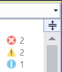
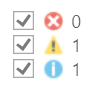

# Error Catcher II

Download this extension from the [VS Marketplace](https://marketplace.visualstudio.com/items?itemName=MadsKristensen.ErrorCatcherII)
or get the [CI build](http://vsixgallery.com/extension/376e6cdc-893d-4ae7-ad93-325575c35301/).

---------------------------------------

The easiest way to make sure not to miss any errors or warnings in any code file.

See the [change log](CHANGELOG.md) for changes and road map.

### Show errors

Sometimes it can be hard to tell if the file you're editing
contains errors. Perhaps the error is all the way to the bottom
of the file and you don't notice it. You might save the file
containing the error and something bad happens when you then
try to run your application.

### Customize
You can decide if you wish to show errors, warnings and/or messages. Just right-click on the icons to enter edit mode. Then check the checkboxes for each of the error types you wish to see.

### How it works

1. Displays errors at the top right corner of the editor
2. Displays both the number of errors, warnings and messages
3. Only shows errors that are currently visible in the Error List
4. Right-click icons to enter edit mode
5. Left-click icons to open Error List

## Contribute
Check out the [contribution guidelines](.github/CONTRIBUTING.md)
if you want to contribute to this project.

For cloning and building this project yourself, make sure
to install the
[Extensibility Tools 2015](https://visualstudiogallery.msdn.microsoft.com/ab39a092-1343-46e2-b0f1-6a3f91155aa6)
extension for Visual Studio which enables some features
used by this project.

## License
[Apache 2.0](LICENSE)